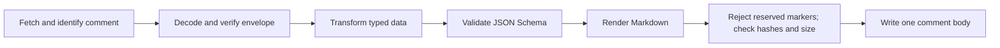

# gh-slate CLI design

Status: implementation-backed through batch 7; jq-style data CRUD and remote
schema commands are complete offline, and batch 8 is the next implementation
layer. The
credentialed Issue/PR smoke gate remains open, so the snapshot MVP is not yet
labelled alpha-ready.

`gh-slate` manages named, data-backed dashboard comments on GitHub Issues and
Pull Requests.

The central model has one reversible state boundary and one one-way rendering
boundary:

```text
managed comment envelope  <-- encode/decode -->  typed StateV1
                                                    |
                                                  render
                                                    v
                                             visible Markdown
```

The hidden typed state is the source of truth. The visible Markdown is a
projection of that state, not a database that `gh-slate` tries to reverse
engineer. The envelope and visible projection are stored together in one named
GitHub Issue or Pull Request comment.

## 1. Design decisions

### 1.1 One target model for Issues and Pull Requests

GitHub's regular Pull Request timeline comments use the issue-comment API.
`gh-slate` therefore has one target abstraction instead of duplicated `issue`
and `pr` command trees.

A slate is identified by:

```text
(host, repository, issue-or-pr number, name, controller)
```

- `name` is the stable user-facing ID.
- `controller` is the immutable GitHub user ID that owns the managed comment on
  that host; its login is retained only for display and explicit-name lookup.
- The same name may be reused on different Issues or Pull Requests.
- Names must match `[a-z0-9][a-z0-9._-]{0,63}` and must not contain `--`,
  keeping the identifier safe inside the HTML comment marker.

### 1.2 State round-trips; Markdown does not

Markdown tables and lists have no type system. These values are ambiguous after
rendering:

```text
001       number or string?
true      boolean or string?
null      null or string?
          missing, null, or empty string?
```

Nested objects, escaped pipes, newlines, and user formatting make the problem
worse. A JSON Schema alone cannot make arbitrary edited Markdown lossless.

The reversible boundary is the managed comment envelope to and from canonical,
typed `StateV1`. Rendering is a separate deterministic projection from
`StateV1` to Markdown:

```text
decode_state(encode_state(StateV1)) == canonicalize(StateV1)
render(StateV1) -> normalized visible Markdown
```

The second line is intentionally not a bidirectional arrow. v1 does not define
`parse_markdown(Markdown) -> typed data`, even for output produced by the
built-in table or list renderer.

The comment stores canonical typed JSON and, when supplied, its JSON Schema.
`gh slate data get` decodes the state directly. It never infers state by parsing
the rendered table or list. When the stored render hash verifies, rerendering
the decoded `StateV1` must reproduce the normalized visible Markdown byte for
byte.

Manual edits to the visible Markdown produce a render-hash mismatch. Mutating
commands fail with a drift error instead of guessing user intent or silently
overwriting the edit. `gh slate repair --from-state` explicitly restores the
projection from the stored state.

A future `data import-markdown` may support the exact canonical output of a
specific built-in renderer version. It is not part of v1 and must never be an
implicit fallback.

### 1.3 A comment is a self-contained state container

The comment embeds all information required for a later process to update data
and rerender it:

- slate name and format version;
- canonical JSON data;
- optional JSON Schema;
- renderer kind, version, and resolved options;
- Jinja source when the renderer is Jinja;
- revision and integrity hashes.

The repository, number, and comment URL are target context rather than portable
state. A remote rerender obtains them from the comment location and must pass
the same `SlateContext` used for the previous render. The pure local command has
no target, so it exposes those three fields as explicit JSON `null` values. The
rendering API refuses to rerender a stored Jinja state without an explicit
target context; built-in table/list renderers do not depend on it.

Storing only a template path is insufficient: a later CI run may not have the
same checkout, branch, file, or Contents API permission. A future version may
support a pinned Git blob reference such as `repo@sha:path`, but never an
unversioned moving-branch reference by default.

HTML comments are not private. Anyone who can read the GitHub comment can read
the embedded template, schema, and data through the API or page source. Comment
edit history may also retain old values. Secrets must never be stored in a
slate.

## 2. Command tree

```text
gh slate
├── apply NAME                 create, update, or rerender a slate
├── render NAME                render locally without writing GitHub
├── view NAME                  show the rendered comment or metadata
├── list                       list managed slates on a target
├── repair NAME --from-state   restore visible Markdown from stored state
├── delete NAME                delete the entire managed comment
├── data
│   ├── get NAME [FILTER]      query data with jq
│   ├── set NAME PATH          set one value using an exact jq path
│   ├── delete NAME PATH...    delete values using exact jq paths
│   ├── update NAME FILTER     transform the full data object with jq
│   └── edit NAME              edit typed JSON in $GH_EDITOR/$EDITOR
├── schema
│   ├── get NAME               print the stored JSON Schema
│   ├── set NAME FILE          replace and validate the JSON Schema
│   ├── infer NAME             infer a permissive schema from current data
│   └── validate NAME [FILE]   validate current or supplied data
├── state
│   ├── export NAME            decode the complete state envelope as JSON
│   └── verify NAME            verify state, schema, and render hashes
└── doctor                     check gh, auth, jq runtime, and connectivity
```

`apply` is the normal CI command. Strict create-only and update-only behavior
are modes instead of separate top-level commands:

```text
--mode upsert     create or update; the default
--mode create     fail if the slate already exists
--mode update     fail if the slate does not exist
```

## 3. Common target and output options

All remote commands accept:

```text
-t, --target TARGET       Issue/PR number, URL, @event, or @pr
-R, --repo OWNER/REPO     repository for a numeric target
    --controller LOGIN    resolve a controller login to its stable host-local ID;
                          defaults to the current token actor
    --host HOST           normally inherited from gh/GH_HOST
    --if-revision REV     reject a stale read before attempting a write
    --json                emit an operation result object
-q, --quiet               suppress successful mutation output
```

Resolution rules are deliberately conservative:

1. A full Issue or Pull Request URL supplies host, repository, and number.
2. A number uses `-R/--repo`, or the current repository when `-R` is omitted.
3. `@event` reads `GITHUB_EVENT_PATH`.
4. `@pr` explicitly resolves the current branch's Pull Request.
5. In GitHub Actions, an omitted target may behave as `@event`.
6. Locally, an omitted target is an error. A write must not silently guess the
   current branch's Pull Request.

If a URL and `--repo` disagree, the command fails.

Default successful mutation output is one line:

```text
updated ci-summary -> https://github.com/owner/repo/pull/42#issuecomment-123
```

`--json` returns:

```json
{
   "action": "updated",
   "name": "ci-summary",
   "repository": "owner/repo",
   "number": 42,
   "comment_id": 123,
   "url": "https://github.com/owner/repo/pull/42#issuecomment-123",
   "revision": 8,
   "state_sha256": "..."
}
```

`action` is one of `created`, `updated`, `repaired`, `deleted`, or `unchanged`.
Unchanged input does not send a PATCH request.

## 4. Creating and applying a slate

### 4.1 Jinja renderer

```bash
gh slate apply ci-summary \
  --target 42 \
  --repo owner/repo \
  --template .github/slates/ci-summary.md.j2 \
  --data report.json \
  --schema report.schema.json
```

The template is embedded as source, not retained as a local path.

The template context is intentionally small:

```jinja2
{{ data.summary.passed }}
{{ slate.name }}
{{ slate.repository }}
{{ slate.number }}
{{ slate.url }}
```

Data keys are not promoted to global variables. Jinja uses an immutable sandbox,
`StrictUndefined`, no filesystem loader, and no include/import support. It does
not expose environment variables, tokens, network access, or arbitrary Python
objects.

The v1 adapter canonicalizes the `data` object through the JSON codec before
exposing an immutable value. It clears Jinja's default globals, filters, and
tests, then installs only the documented filters and the minimal
`defined`/`undefined`/`none` tests. Attribute and callable access are denied;
includes, imports, extends, calls, macros, call blocks, multiplication, and
power expressions are rejected from the parsed AST. Containers cannot be
interpolated implicitly and must pass through `md_table`, `md_list`, or
`compact_json`.

The default execution profile accepts at most 64 KiB of UTF-8 template source,
2,000 AST nodes, a conservative 1,000-unit loop-work budget, and 48 KiB of
streamed UTF-8 output. The implementation hard caps configurable AST and loop
budgets at 10,000. It consumes generated chunks incrementally and fails when
their cumulative UTF-8 size crosses the output limit. The canonical renderer
descriptor, including JSON escaping and field overhead, must independently fit
the 64 KiB renderer-component limit; a source at the raw ceiling may therefore
be rejected. A limit violation is a validation error before any remote write.

Built-in deterministic filters include:

```jinja2
{{ data.jobs | md_table(columns=["name", "status", "duration_ms"]) }}
{{ data.notes | md_list }}
{{ data.metadata | compact_json }}
```

### 4.2 Built-in table renderer

For common dashboards, no template is required:

```bash
gh slate apply test-matrix \
  --target 42 \
  --data report.json \
  --table '.jobs' \
  --columns name,status,duration_ms \
  --title 'Test matrix'
```

`--table FILTER` is a jq selector evaluated against the data root. It must
produce exactly one value. It is stored in the renderer specification and is
reevaluated after every data update.

Renderer selectors run in an isolated Python subprocess with isolated-mode
imports, an empty environment, and an empty temporary working directory.
Environment, build, and module facilities (`env`, `$ENV`, `import`, `include`,
`module`, and `modulemeta`) are rejected before evaluation. Stored selectors
also reject time/date wrappers and the complete jq 1.7 C math builtin surface,
whose availability and results depend on the host OS and C library. The default
selector profile limits the filter to 16 KiB, canonical input and jq output to
256 KiB each, wall time to 2 seconds, address space to 512 MiB, and CPU time to
2 seconds. OS memory and CPU rlimits are applied where supported; the wall
timeout and byte limits remain mandatory on every platform.

The serialized-output cap does not imply that one jq value is materialized
incrementally: libjq may allocate that value inside the isolated worker before
encoding reaches the byte cap. The separate worker address-space limit is the
ceiling on supported operating systems.

The isolated result is parsed back through the immutable JSON codec, so jq
cannot mutate the input `StateV1`. libjq nevertheless uses IEEE-754 numeric
semantics: a selected integer outside the exactly representable range may be
rounded in the projection. Identifiers and arbitrary-precision values that
must remain exact through a jq projection must be encoded as strings.

The accepted `table@1` shape is an array of objects: one row per item.

`table@1` deliberately rejects mixed arrays, scalar roots, and object-of-object
heuristics. Those shapes quickly become ambiguous around row identity, missing
values, and schema evolution. Select or normalize rows with jq first, or use the
list renderer.

For an array of objects, column order is resolved once and stored:

1. explicit `--columns`;
2. property order from a declared schema;
3. deterministic inference at creation time.

New fields do not silently rearrange or extend an existing table. Reapplying
`--columns` explicitly changes the renderer specification.

Every stored column path is a non-empty JSON array of typed path segments.
String segments select object keys and non-negative integer segments select
array indexes. For example, `["job", "name"]` and
`["attempts", 0, "duration_ms"]` are paths; `.job.name`, JSON Pointer, and a
single dotted string are not. This representation preserves a key such as
`"key.with.dot"` and distinguishes the object key `"0"` from array index `0`.
The `--columns name,status` shorthand and Jinja's
`md_table(columns=["name", "status"])` each resolve to one-string-segment paths
before the renderer descriptor is stored.

An empty array can render an empty table when columns or an item schema are
available. Otherwise it renders `_No data._` and asks for explicit columns.

Default cell rendering is deterministic:

| JSON value       | Markdown projection             |
| ---------------- | ------------------------------- |
| string           | escaped text                    |
| number           | canonical JSON number           |
| boolean          | `true` or `false`               |
| null             | `null`                          |
| missing property | `—`                             |
| array/object     | compact JSON in code formatting |

ASCII punctuation is emitted as inert numeric character references and newlines
as trusted `<br>` elements, so emphasis, links, images, mentions, autolinks,
table delimiters, and HTML in untrusted strings remain display text. Raw
Markdown cells require an explicit trusted renderer option; they are never
inferred from a string.

### 4.3 Built-in list renderer

```bash
gh slate apply release-notes \
  --target 42 \
  --data release.json \
  --list '.changes' \
  --title 'Release notes'
```

`--list FILTER` also must produce exactly one value.

- arrays become bullet lists;
- objects become deterministically sorted `key: value` items;
- nested arrays/objects recurse to a bounded depth;
- values beyond that depth use compact JSON.

Arrays retain their order and index labels. Empty objects, empty arrays, null,
missing values, and empty strings have distinct projections. Depth or item
limits always render an explicit truncation notice; they never silently drop
content.

The shared default local-render profile permits at most 500 table rows, 64
table columns, 8 list levels, 1,000 rendered list items, and 48 KiB of UTF-8
Markdown. The stored list defaults are lower (4 levels and 500 items).
Row/item/depth truncation is explicit; excess columns or output bytes are
validation errors.

Both built-in renderers are one-way projections. Their Markdown, including
escaping and truncation notices, is never parsed back into typed data.

`--template`, `--table`, and `--list` are mutually exclusive renderer choices.
When updating an existing slate, omitting all three reuses the embedded renderer.
Creating a new slate requires one of them.

### 4.4 Apply semantics

```bash
# Replace the full data snapshot but keep the embedded renderer and schema.
gh slate apply ci-summary --target 42 --data new-report.json

# Replace the renderer but keep current data.
gh slate apply ci-summary --target 42 --template new-layout.md.j2

# Validate and preview without a GitHub write.
gh slate apply ci-summary --target 42 --data report.json --dry-run
```

For an existing slate:

- `--data` replaces the complete data object;
- `--schema` replaces the declared schema;
- a renderer option replaces the renderer;
- omitted components keep their stored values.

For a new slate:

- data defaults to `{}`;
- a renderer is required;
- schema is optional.

The data root must be a JSON object. This keeps Jinja context and future schema
evolution predictable. Arrays belong under object fields.

Every mutation follows one transaction-like client pipeline:



Any decode, jq, schema, Jinja, drift, reserved-marker, or size error occurs
before the write. Rendered Markdown containing the managed
`<!-- gh-slate:` prefix is rejected as a whole before any POST or PATCH, so a
template cannot smuggle a second managed marker into the visible projection.

### 4.5 Other lifecycle commands

`render` writes Markdown only to stdout and never writes GitHub:

```bash
# Pure local render.
gh slate render ci-summary \
  --data report.json \
  --table '.jobs' \
  --columns name,status

# Fetch stored state and verify that it still renders deterministically.
gh slate render ci-summary --target 42
```

Local file and stdin reads are bounded before allocation. JSON input is capped
at the strict parser's 8 MiB source limit and then at the smaller canonical
data/schema component limits; Jinja input is capped at 64 KiB before decoding.
Local render also enforces the canonical renderer-component and visible-output
limits, so a successful preview is eligible for later state materialization.
Because a target-sensitive Jinja branch cannot be bounded using placeholder
values, pure local render rejects templates that reference
`slate.repository`, `slate.number`, or `slate.url`. Use `apply --dry-run` with
the intended target to preview and validate those templates without writing.

`view` prints the visible Markdown by default. `--json` returns identity,
controller, renderer, schema presence, revision, hashes, drift status, and
comment URL. `--web` opens the comment:

```bash
gh slate view ci-summary --target 42
gh slate view ci-summary --target 42 --web
gh slate list --target 42 --json
```

Read-only data/state commands continue to return canonical stored state when the
visible Markdown has drifted, with a warning. Every write fails closed until the
user chooses an explicit resolution:

```bash
# Discard the manual visible edit and restore the canonical projection.
gh slate repair ci-summary --from-state --target 42

# Edit canonical typed data instead, then validate and rerender.
gh slate data edit ci-summary --target 42
```

Deleting the whole comment requires confirmation:

```bash
gh slate delete ci-summary --target 42 --confirm ci-summary
gh slate delete ci-summary --target 42 --yes
```

The second form is intended for non-interactive automation. Neither repair nor
delete has a generic `--force` flag.

## 5. jq-style data CRUD

The embedded jq engine operates only on `envelope.data`. It cannot modify the
slate name, controller, renderer, schema, revision, or hashes.

The implementation should use the maintained Python `jq` binding so expressions
have real jq semantics. It should not require a separate `jq` executable and
should not call a home-grown expression language “jq”.

### 5.1 Read

```bash
gh slate data get ci-summary '.' --target 42

gh slate data get ci-summary \
  '.jobs[] | select(.status == "failed") | .name' \
  --raw-output \
  --target 42
```

The default filter is `.`. A query may produce zero, one, or many results and
supports jq-like `--raw-output`, `--compact-output`, and `--exit-status`.
One invocation returns at most 1,024 results by default; crossing the bounded
result limit is a validation error rather than an unbounded allocation.

### 5.2 Set

```bash
# JSON number
gh slate data set ci-summary '.coverage.lines' \
  --value 91.7 \
  --target 42

# JSON string, without shell-level JSON quoting
gh slate data set ci-summary '.status' \
  --value-string passing \
  --target 42

# JSON object loaded from a file
gh slate data set ci-summary '.jobs.linux' \
  --value-file linux-result.json \
  --target 42

# A key that itself contains a dot
gh slate data set ci-summary '.["key.with.dot"]' \
  --value-string preserved \
  --target 42
```

`PATH` must be an exact jq path expression. Internally it is resolved with jq
`path`/`setpath` semantics; arbitrary transforms belong in `data update`.
Missing containers are created according to the next typed path segment, and
arrays are padded with JSON nulls when an exact non-negative index extends
them. The final mutation runs in Python so untouched arbitrary-precision
integers are not round-tripped through libjq.

Value sources are mutually exclusive and never guessed:

- `--value JSON` parses one JSON value;
- `--value-string TEXT` stores an exact string;
- `--value-file FILE` parses one JSON document;
- `-` may explicitly mean stdin where a value/file option permits it.

This keeps `"91"`, `91`, `true`, `"true"`, and `null` distinct.

### 5.3 Delete

```bash
gh slate data delete ci-summary \
  '.jobs.experimental' \
  '.legacy' \
  --target 42
```

Deleting an absent path is an error by default and can be made idempotent with
`--ignore-missing`.

### 5.4 Arbitrary update

```bash
gh slate data update ci-summary \
  '.jobs[$job] = $result | .updated_at = $now' \
  --arg job linux \
  --argjson result @linux-result.json \
  --arg now "$NOW" \
  --target 42
```

- `--arg NAME VALUE` passes a string.
- `--argjson NAME JSON` passes typed JSON; `@FILE` loads a JSON file.
- The filter receives one data object and must emit exactly one data object.
- Zero results, multiple results, or a scalar/array result are validation
  errors with no remote write.
- A result identical to the current data returns `unchanged`.

### 5.5 Interactive edit

```bash
gh slate data edit ci-summary --target 42
```

This opens pretty-printed JSON in `GH_EDITOR`, then `GIT_EDITOR`, `VISUAL`, or
`EDITOR`. On editor exit, the command parses JSON, validates the schema,
rerenders, shows a summary, and performs one update. Invalid JSON or schema
violations reopen the editor interactively or fail without writing in
non-interactive mode.

### 5.6 Batch patching

RFC 6902 JSON Patch is a useful machine/batch interface, including its `test`
operation, but it introduces a second path language (JSON Pointer). It should be
added after the jq/set/delete surface is stable:

```bash
gh slate data patch ci-summary patch.json --target 42
```

RFC 7396 Merge Patch may be a later `--type merge` option. Its `null` means
delete and arrays replace wholesale, so it must not be the only patch format.

## 6. Schema and type rules

Canonical JSON already preserves JSON types, missing properties, and nulls. A
schema adds validation and domain meaning; it is not a substitute for storing
the data.

Schemas use JSON Schema draft 2020-12:

```bash
gh slate schema set ci-summary report.schema.json --target 42
gh slate schema get ci-summary --target 42
gh slate schema validate ci-summary candidate.json --target 42
gh slate schema infer ci-summary --target 42 > inferred.schema.json
gh slate schema infer ci-summary --target 42 --apply
```

Every later mutation validates before rendering and writing.

Schemas are snapshots in the envelope. Remote `$ref` loading is disabled:
validation must not depend on the network or create an SSRF/file-read surface.
The v1 schema boundary accepts only the exact draft 2020-12 dialect. A schema's
root `$schema`, when present, must name that same dialect. `$ref` and
`$dynamicRef` may use only an empty reference or a same-document `#...`
fragment; network URLs, file URLs, protocol-relative URLs, and relative file or
registry references are rejected even when they appear in an unevaluated
branch. A deny-all resolver remains installed as a second line of defense.

Validation failures expose bounded, deterministically sorted diagnostics. Each
violation carries an RFC 6901 data pointer, an RFC 6901 schema pointer, the
failing keyword, and a human-readable message. Machine consumers should branch
on the error code, pointers, and keyword rather than treating dependency-owned
message prose as a stable API. The default diagnostic cap is 32 violations and
reports whether more were truncated. Each pointer is capped at 1 KiB; a
path-derived suffix and an explicit `*_pointer_truncated` flag replace an
oversized tail.

The local validator also applies the state component limits to schema and data
before evaluation. Regex keywords run with per-match timeouts, `uniqueItems`
uses canonical JSON identities instead of quadratic pairwise comparison, and a
shared execution/operation budget fails with `schema_evaluation_limit`. These
limits make an embedded schema safe to inspect in the CLI; they are part of the
gh-slate execution profile, not changes to the stored JSON Schema document.

`schema infer` creates a deliberately permissive starting point:

- it records observed types;
- object properties are not required by default;
- additional properties remain allowed;
- an empty array gets an unconstrained item schema;
- heterogeneous arrays merge all observed types and object-property shapes;
- an observed missing property is not converted into an observed `null`;
- it does not invent semantic formats.

Users can edit and apply the inferred schema when stricter validation is wanted.
`schema infer` is read-only by default and prints the inferred document.
`--apply` explicitly stores that exact snapshot through the same
revision-pinned mutation pipeline as `schema set`.
Standard schema annotations such as `title`, `description`, and `format` may
inform built-in rendering. Presentation details such as selected rows and
column order remain in the renderer specification so schema validation and
layout do not become entangled.

Round-trip guarantees follow JSON semantics. They do not promise to preserve
whitespace, object key spelling order, or a number's original textual lexeme.
Renderer projections inherit libjq's IEEE-754 numeric semantics and may round
an otherwise valid canonical JSON integer in visible Markdown. A full
`data update` fails closed before writing when either its input or result
contains an integer outside jq's exact range
`[-9007199254740991, 9007199254740991]`; `data set` and `data delete` keep
untouched arbitrary-precision integers in Python. Before running a full update,
identity preflights also reject any stored value or `--argjson` binding that
libjq would round merely by reading it, and numeric filter literals must
round-trip through the same runtime. These are storage-boundary checks, not an
arbitrary-precision arithmetic engine: jq calculations retain libjq's
IEEE-754 semantics. IDs or numbers that must participate in arithmetic outside
those guarantees should be stored as strings and described as strings in the
schema.

JSON ingestion rejects duplicate object keys, NaN, and Infinity.

## 7. Comment envelope

A managed comment begins with a versioned hidden marker:

```md
<!-- gh-slate:v1 name=ci-summary encoding=zlib+base64 state=6d3f...
eNqVksFO...
-->

## CI summary

| Job   | Status |
| ----- | ------ |
| linux | passed |
```

The payload is:

1. canonical JSON encoded as UTF-8;
2. compressed with the state-v1 zlib profile;
3. encoded with standard base64.

Standard base64 is used inside the HTML comment because its alphabet does not
contain `-`. Together with the slate-name restriction above, this prevents an
accidental `--` inside the HTML comment content. Decoding has strict compressed
and expanded-size limits.

For `state-v1`, canonical JSON means sorted object keys, UTF-8 with non-ASCII
characters preserved, minimal separators, no NaN/Infinity, and a versioned
number serializer. Object keys are ordered by Unicode code point after rejecting
unpaired surrogates. Strings use JSON escapes only for control characters,
quotes, and backslashes; `/` and valid non-ASCII characters remain unescaped.
Numbers normalize negative zero to `0`, remove insignificant trailing zeroes,
use plain notation when the adjusted exponent is from `-6` through `20`, and
otherwise use lowercase `e` scientific notation with an explicit `+` for a
non-negative exponent. Hashes cover these exact canonical bytes before
compression. This is a gh-slate wire rule, not a claim of preserving the input
file's lexical format.

Visible Markdown normalization changes CRLF and bare CR to LF and appends one LF
only when the value does not already end in LF. Existing additional trailing
line feeds and all other bytes are preserved.

The zlib wrapper, level, window, memory level, and fixed-Huffman strategy are
part of the state-v1 encoder profile, but the resulting DEFLATE bytes are not
canonical: different conforming zlib versions may choose different valid block
and match layouts. Therefore the state hash deliberately excludes compression
and Base64. A permanent full-comment fixture is a decoder compatibility
contract; implementations are not required to reproduce its compressed payload
byte-for-byte when re-encoding the same state.

The decoded envelope is conceptually:

```json
{
   "format": "gh-slate/state-v1",
   "name": "ci-summary",
   "revision": 7,
   "controller": {
      "id": 41898282,
      "login": "github-actions[bot]"
   },
   "data": {
      "jobs": [
         {
            "name": "linux",
            "status": "passed"
         }
      ]
   },
   "data_schema": {
      "dialect": "https://json-schema.org/draft/2020-12/schema",
      "document": {
         "type": "object"
      }
   },
   "renderer": {
      "kind": "builtin-table",
      "version": 1,
      "selector": ".jobs",
      "columns": [
         {
            "path": ["name"],
            "header": "Job"
         },
         {
            "path": ["status"],
            "header": "Status"
         }
      ]
   },
   "render_sha256": "..."
}
```

For Jinja, `renderer` instead contains a versioned Jinja adapter and the exact
template source.

Important invariants:

- the marker and envelope names must agree;
- the state hash covers the exact canonical `StateV1` bytes, including revision
  and render hash, but excluding the transport marker/compression;
- `render_sha256` covers exact normalized visible Markdown;
- rendered Markdown may not contain the reserved `<!-- gh-slate:` prefix;
- revisions increase on functional state changes;
- functional change comparison excludes only the revision field;
- a repair of visible drift may keep the same functional revision;
- decoders reject unknown marker/state-format major versions;
- renderer descriptors, including unknown kinds and versions, remain opaque,
  lossless, and readable by operations that do not rerender;
- operations that must rerender reject unsupported renderer versions until an
  explicit migration is performed.

Wire format, renderer version, JSON Schema dialect, and Jinja adapter version
evolve independently. An unknown newer renderer may still allow
`data get`/`state export`, but any command that must rerender fails until an
explicit renderer migration is performed.

`state export` is the inspection and portability escape hatch:

```bash
gh slate state export ci-summary --target 42 > state.json
gh slate state verify ci-summary --target 42
```

The CLI never asks users to decode base64 manually.

## 8. Finding and owning the comment

`list` must paginate through all issue comments. Editing a comment does not move
an old comment to the newest page.

Matching rules:

1. match the exact versioned marker and name;
2. resolve the requested login, or current token actor by default, to a
   host-local immutable GitHub user ID;
3. require the comment author's ID and, when present, the embedded controller ID
   to equal that resolved ID; a legacy login-only envelope is accepted only
   through the authoritative comment-author ID and is upgraded on its next
   write; logins are display metadata and never ownership keys;
4. verify the envelope, state hash, and name;
5. require exactly one match.

Zero matches means create for `apply --mode upsert`. Multiple matches are a
conflict and no comment is selected, updated, or deleted automatically.

The controller check prevents an untrusted user from posting a forged marker
that a write-capable bot later adopts, and it remains valid when a GitHub login
is renamed. User IDs are interpreted only on the resolved GitHub host.
Cross-controller migration must be an explicit future `adopt` operation or a
fully specified comment ID plus a force confirmation.

## 9. Concurrency

GitHub's comment update endpoint does not provide a documented compare-and-swap
operation. Conditional requests are generally unsupported for unsafe methods
such as PATCH unless an endpoint explicitly says otherwise.

Therefore this sequence is not linearly atomic:

```text
GET state -> transform -> render -> PATCH comment
```

Two writers can read the same revision and the later PATCH can overwrite the
earlier result. `revision`, `state_sha256`, `--if-revision`, a second pre-write
read, and post-write verification detect many conflicts but cannot remove the
final time-of-check/time-of-use window.

The supported v1 model is one writer per slate:

- use a GitHub Actions `concurrency` key based on repository, target, and name;
- aggregate parallel job outputs first, then perform one full-snapshot apply;
- use different slate names for independent producers;
- do not automatically replay a non-idempotent jq filter after a conflict.

Timeout recovery first refetches the comment. If its state hash is the intended
hash, the operation succeeded. Otherwise the result is reported as unknown or
conflicted; create/update is not blindly retried.

## 10. Size, safety, and trust boundaries

The final comment duplicates some information: rendered Markdown is visible and
the typed source is hidden. Compression reduces the state overhead but does not
turn a comment into artifact storage.

Before writing, the CLI enforces conservative limits on:

- template source;
- canonical data, schema, and renderer descriptor;
- decompressed envelope;
- rendered Markdown;
- final UTF-8 comment body.

An oversize error reports a breakdown for template, data, schema, encoded state,
rendered output, and total body. Raw benchmark logs and test artifacts belong in
artifact storage; a slate should contain their display summary and links.

Built-in table/list renderers escape untrusted strings. Jinja templates and jq
filters are executable input and must be trusted.

In particular, a privileged `pull_request_target` workflow must not check out
and execute a fork's template, jq filter, or code. A safe pattern is:

1. an unprivileged `pull_request` job runs tests and emits a bounded JSON
   artifact;
2. a privileged reducer uses a template from the trusted default branch;
3. it validates the artifact against a fixed schema and size limit;
4. it performs one slate update.

Typical workflow permissions are:

```yaml
permissions:
   contents: read
   issues: write
   pull-requests: write
```

Use only the write permission needed by the target type where possible.

## 11. Exit codes

```text
0  success, including unchanged
1  authentication, network, GitHub API, or other runtime failure
2  CLI usage, JSON, jq, schema, Jinja, or size validation failure
3  slate or target not found
4  already exists, duplicate marker, drift, or revision conflict
```

Created, updated, and unchanged are represented by the operation result, not by
different success exit codes. Diagnostics go to stderr. `data get` may use
documented jq-compatible query exit behavior when `--exit-status` is supplied.

## 12. Installation surface

The names should map consistently:

```text
PyPI distribution       gh-slate
Python import package   gh_slate
console script          gh-slate
GitHub repository       gh-slate
gh extension command    gh slate
```

Like `gh-llm`, a root executable named `gh-slate` can forward extension
arguments to the Python console script through `uv`. It should set a display
command so both generated hints and argparse usage show the actual invocation:

```text
gh-slate ...    when installed as a Python tool
gh slate ...    when installed as a gh extension
```

The runtime dependencies implied by this design are:

- Jinja for sandboxed templates;
- the Python `jq` binding for real jq semantics;
- a JSON Schema validator.

The GitHub layer should reuse `gh` authentication, host selection, proxy
configuration, and `gh api`; it does not need a separate GitHub SDK or token
store.

## 13. Bundled agent skill

Like `gh-llm`, the repository should ship an installable agent skill alongside
the CLI:

```text
skills/
└── gh-slate/
    └── SKILL.md
```

The initial skill identity is:

```yaml
---
name: gh-slate
description: Create and safely maintain named, data-backed dashboard comments on GitHub Issues and Pull Requests with gh-slate.
metadata:
   primary-tools:
      - gh-slate
      - gh
---
```

Install it directly from the repository:

```bash
npx skills add https://github.com/ShigureLab/gh-slate --skill gh-slate
```

Installing the `gh` extension or PyPI tool does not implicitly install the
skill. README should document both steps:

```bash
# CLI tool
uv tool install gh-slate
gh-slate doctor

# Or GitHub CLI extension
gh extension install ShigureLab/gh-slate
gh slate doctor

# Agent workflow
npx skills add https://github.com/ShigureLab/gh-slate --skill gh-slate
```

The skill resolves the command prefix once and keeps generated follow-up
commands consistent:

- use `gh slate ...` when installed as a GitHub CLI extension;
- use `gh-slate ...` when installed as a Python tool;
- if neither entrypoint is available, stop at installation/preflight instead
  of emitting commands that cannot run.

### 13.1 Skill trigger and scope

The skill should activate when an agent needs to:

- create or update a stable dashboard/sticky report comment on an Issue or Pull
  Request;
- publish CI, coverage, benchmark, test-matrix, deployment, or release status
  as a named slate;
- query or modify a slate's structured data;
- render structured data as a Markdown table/list or through Jinja;
- inspect, verify, or repair a managed slate.

The skill coordinates the CLI. It does not implement a second state format,
renderer, path language, or GitHub API client.

### 13.2 Required agent workflow

The skill must teach agents to follow this order:

1. Confirm `gh` authentication and run `gh slate doctor` when the environment
   is uncertain.
2. Resolve an explicit repository, target, and stable lowercase slate name.
3. Before mutating an existing slate, inspect it with `view`, `state verify`, or
   `data get`.
4. Validate input JSON and the stored schema before rendering.
5. Use `--dry-run` for a new renderer/template or a material layout change.
6. Prefer a complete `apply --data FILE` snapshot in CI. Use incremental
   `data set/update/delete` only with a single writer.
7. Read the returned action, revision, state hash, and comment URL before
   claiming that a write succeeded.
8. Treat `created`, `updated`, and `unchanged` as distinct outcomes even though
   all exit successfully.

The skill must never:

- put credentials, tokens, private logs, or other secrets into data, schema, or
  template source;
- infer canonical data by parsing visible Markdown;
- overwrite a drifted view with a generic force flag;
- silently choose one of multiple matching comments;
- claim remote success before the command returns a confirmed result;
- run a Jinja template or jq filter from an untrusted fork in a privileged
  workflow;
- present incremental comment updates as atomic or safe for concurrent writers.

When drift is detected, it should offer the two explicit paths:

```bash
gh slate repair NAME --from-state --target TARGET --repo OWNER/REPO
gh slate data edit NAME --target TARGET --repo OWNER/REPO
```

### 13.3 Skill command recipes

The skill should contain copy-ready recipes for the common paths rather than
requiring an agent to reconstruct flags.

Create or replace a table-backed CI slate:

```bash
gh slate apply ci \
  --target TARGET \
  --repo OWNER/REPO \
  --data ci.json \
  --schema ci.schema.json \
  --table '.jobs' \
  --columns name,status,duration_ms \
  --json
```

Query current state:

```bash
gh slate data get ci \
  '.jobs[] | select(.status == "failed")' \
  --target TARGET \
  --repo OWNER/REPO
```

Perform a typed update:

```bash
gh slate data update ci \
  '.jobs |= map(if .name == $name then . + $result else . end)' \
  --arg name linux \
  --argjson result @linux-result.json \
  --target TARGET \
  --repo OWNER/REPO \
  --json
```

Publish one full snapshot from CI:

```bash
gh slate apply ci \
  --target "$PR_NUMBER" \
  --repo "$GITHUB_REPOSITORY" \
  --data ci.json \
  --json
```

Recipes should use multiline-safe file/stdin forms for JSON and templates. They
should include the GitHub Actions permissions and concurrency key described in
this design.

### 13.4 Keeping the skill correct

The skill is part of the public interface and must version with the CLI:

- every command shown in `SKILL.md` must be covered by parser/help smoke tests;
- installation of `skills/gh-slate/SKILL.md` from the repository must be tested;
- CLI option renames require the skill and README to change in the same PR;
- the skill should state the minimum compatible `gh-slate` version;
- the skill should link to this design/reference instead of duplicating the
  complete wire-format specification;
- release checks should scan the skill for stale command prefixes and removed
  flags.

The skill should stay task-oriented and compact. Deep protocol details belong
in the CLI reference; the skill should focus on choosing the safe command,
checking its evidence, and reporting the confirmed result.

## 14. Implementation plan

The `codex/cli-design` branch is batch 0: it freezes the initial CLI, state,
rendering, ownership, and safety contract. Batches 1 through 4 now provide the
package, codec, schema, and local-rendering foundation. The implementation uses
nine focused stacked PRs. This is more PRs than a coarse component split, but it
keeps the wire format, local rendering, remote reads, and remote writes
independently reviewable.

The codec and renderer layers must merge before any remote write is enabled.
The most important correctness properties remain:

```text
decode_state(encode_state(StateV1)) == canonicalize(StateV1)
render(StateV1) == normalized visible Markdown when render_sha256 verifies
there is no Markdown-to-typed-data inverse in v1
```

### 14.1 Stack shape and delivery waves

The planned branch chain, from bottom to top, is:

```text
main
└── codex/cli-design                       batch 0: design contract
    └── codex/package-cli                  batch 1: package and entrypoints
        └── codex/state-codec              batch 2: typed state envelope
            └── codex/schema-core          batch 3: schema validation
                └── codex/local-renderers  batch 4: local rendering
                    └── codex/github-read-store  batch 5: remote reads
                        └── codex/github-apply  batch 6: snapshot writes
                            └── codex/data-crud  batch 7: jq CRUD
                                └── codex/recovery-hardening  batch 8: recovery
                                    └── codex/automation-skill-release  batch 9: release
```

Branches should be created only when work on that layer starts; there is no
benefit in creating nine empty branches in advance. Submit and review the stack
in three waves so reviewers do not have to track every layer at once:

| Wave                  | Batches | Outcome                                                     |
| --------------------- | ------- | ----------------------------------------------------------- |
| Foundation            | 1-4     | installable CLI, frozen codec, schema, local renderers      |
| Snapshot MVP / alpha  | 5-6     | safe read and full-snapshot `apply` against GitHub comments |
| Structured beta to GA | 7-9     | jq CRUD, recovery, Actions, bundled skill, release checks   |

Within each wave, review and merge from the bottom upward. After a lower PR is
merged, run `gh stack sync --remote origin --prune` before continuing. New PRs
are submitted non-interactively with `gh stack submit --auto --remote origin`,
and stack state is inspected with `gh stack view --json`.

If GitHub Stacks are unavailable for the repository, preserve the same branch
bases and PR boundaries as regular dependent PRs. Do not flatten the dependency
order merely to work around the presentation layer.

### 14.2 Batch 1: package and CLI entrypoints

Branch: `codex/package-cli`

Goal: turn the starter repository into an installable `gh-slate` package
without pretending that dashboard operations already work.

Deliverables:

- rename distribution metadata to `gh-slate` and the import package to
  `gh_slate`;
- add the `gh-slate` console script and executable repository-root `gh-slate`
  extension launcher;
- make help, errors, and usage show `gh-slate` for a Python installation and
  `gh slate` for an extension installation;
- establish the parser, structured diagnostics, version reporting, and common
  exit-code infrastructure;
- update project URLs, typing marker, `justfile`, build metadata, and starter
  tests;
- probe the declared Python and operating-system matrix for the planned Jinja,
  JSON Schema, and especially Python `jq` dependencies. Narrow classifiers now
  if the runtime cannot actually be installed on a promised platform.

Acceptance gates:

- wheel and sdist build and install in clean temporary environments;
- `gh-slate --help`, `gh-slate --version`, and the root launcher all work;
- forwarded arguments and exit codes are identical through both entrypoints;
- a missing launcher prerequisite produces a concise actionable error;
- no functional file retains the starter `moelib` name.

Not included: state encoding, renderers, GitHub API access, or placeholder
subcommands that report success without doing the operation.

### 14.3 Batch 2: typed state and comment codec

Branch: `codex/state-codec`

Goal: implement and freeze the pure, local state container before it can be
used in a GitHub write.

Deliverables:

- strict JSON ingestion that rejects duplicate keys, NaN, and Infinity;
- functional state models and versioned renderer descriptors;
- deterministic canonical JSON and the `state-v1` number serialization rules;
- the `gh-slate:v1` marker, versioned zlib profile, standard base64 envelope, state
  hash, render hash, and revision rules;
- explicit normalization of visible Markdown before render hashing;
- compressed, expanded, component, and final-body size accounting;
- structured decoder failures for malformed payloads, marker/envelope name
  disagreement, and unknown marker/state-format major versions; renderer
  descriptors remain lossless and opaque until a rendering operation validates
  support.

Acceptance gates:

- round-trip property tests prove
  `decode_state(encode_state(StateV1)) == canonicalize(StateV1)`;
- canonical bytes and hashes have deterministic golden assertions; permanent
  complete-comment fixtures must remain decodable but need not re-encode to the
  same non-canonical DEFLATE bytes across zlib versions;
- fixtures cover Unicode, nested values, null versus missing, booleans,
  numbers, and empty collections;
- corrupt base64/zlib, duplicate markers, decompression bombs, oversized
  components, and unknown versions fail within bounded memory and before any
  external action;
- a released `state-v1` fixture is never silently rewritten by a later codec.

Not included: Jinja, Markdown rendering, schema validation, GitHub API access,
or parsing typed data from visible Markdown.

### 14.4 Batch 3: JSON Schema core

Branch: `codex/schema-core`

Goal: make schema validation a reusable local boundary shared by render and
mutation code.

Deliverables:

- JSON Schema draft 2020-12 validation;
- schema snapshot models, stable machine-readable diagnostics, and permissive
  schema inference;
- enforcement that the data root is an object;
- complete disabling of network, file, and remote `$ref` resolution;
- local APIs for validate, infer, and schema replacement, without wiring remote
  commands yet.

Acceptance gates:

- remote and local-file/registry `$ref` attempts perform no I/O, while
  same-document fragments remain available;
- inferred schemas preserve observed types but do not invent `required`,
  semantic formats, or `additionalProperties: false`;
- validation paths and messages are stable enough for CLI and JSON output;
- strict JSON ingestion is used for both data and schema documents.

Not included: presentation layout, Markdown renderers, or GitHub-backed schema
commands. Schema annotations may inform later rendering, but schema remains
independent of table columns and selectors.

### 14.5 Batch 4: local renderers

Branch: `codex/local-renderers`

Status: complete. The adapters, integrated engine/CLI, golden fixtures,
dependency probe, size/security boundaries, and acceptance tests are in place.

Goal: deliver a deterministic offline rendering engine and the local `render`
command.

Deliverables:

- the maintained Python `jq` binding and one shared jq evaluation adapter;
- `builtin-table@1` and `builtin-list@1`, including selectors, stored column
  resolution with typed JSON segment arrays, escaping, explicit truncation, and
  strict accepted shapes;
- the sandboxed, immutable Jinja adapter with `StrictUndefined`, no loader, no
  include/import, the minimal documented context, AST/loop/output budgets, and
  streamed output enforcement;
- isolated jq selector execution with no inherited environment or working
  tree, bounded input/output/time/resources, and an explicit IEEE-754
  projection caveat;
- renderer descriptors that retain all resolved options and exact Jinja source;
- the pure local `render` path and component/final-body size checks;
- golden Markdown fixtures and deterministic rerender tests.

Acceptance gates:

- all three renderers produce byte-stable Markdown for their golden fixtures;
- table tests distinguish missing, null, empty string, empty array, and nested
  JSON, cover inert punctuation and newlines, and prove that string and integer
  path segments remain distinct;
- list tests cover object ordering, array ordering, depth limits, and item
  limits without silent loss;
- Jinja cannot access environment variables, files, network, dangerous Python
  attributes, default globals, includes, imports, or mutation, and its
  source/AST/loop/output limits fail deterministically;
- jq selector tests prove subprocess isolation, byte/time/resource failures,
  immutable projection results, and the documented large-integer behavior;
- selectors that return zero or multiple values fail before rendering;
- the dependency matrix installs the actual jq binding on every advertised
  Python/platform combination.

Not included: any GitHub API call, arbitrary Markdown reverse parsing, or
automatic raw-Markdown cells.

At this layer, the foundation is complete: the wire format and renderer
versions are implementation-backed, but no remote command is allowed to write
until batch 6.

### 14.6 Batch 5: read-only GitHub comment store

Branch: `codex/github-read-store`

Status: complete. Target/controller resolution, the GET-only `gh` adapter,
paginated comment classification, canonical-context rerendering, read-only CLI
commands, and fake-`gh` contract tests are implemented.

Goal: prove target resolution, pagination, ownership, and decoding against the
GitHub interface without carrying mutation risk.

Deliverables:

- an injectable `gh api` process adapter that reuses `gh` authentication,
  host, proxy, and credential behavior, while bounding stdout and stderr during
  concurrent pipe reads and terminating the child immediately on overflow;
- resolution of URLs, numbers, `-R`, `@event`, `@pr`, and the documented
  omitted-target rules;
- GitHub.com and GHES host propagation without hard-coded GitHub.com URLs;
- current-actor/controller login-to-ID resolution and pagination through every
  issue comment page;
- exact marker/name/immutable-author-ID matching, integrity verification,
  duplicate detection, and corrupt/drift classification;
- read-only `view`, `list`, `render --target`, `state export`, `state verify`,
  and the complete `doctor` command;
- fake-`gh` contract tests that record every subprocess request.

Acceptance gates:

- tests assert that this layer never issues POST, PATCH, or DELETE;
- an old matching comment on an earlier page is still found;
- URL/repository conflicts, wrong controllers, forged markers, corrupt state,
  and duplicate matches are never silently selected;
- a renamed login with the same user ID remains owned, while the same login with
  a different user ID is never adopted;
- oversized stdout or stderr terminates and reaps `gh` without first buffering
  the unbounded stream;
- read-only commands can return canonical state during visible drift, while
  clearly warning about the mismatch;
- `--host`, `GITHUB_SERVER_URL`, and event payloads route every call to the
  intended GitHub.com or GHES host.

Not included: comment creation/update, repair, deletion, adoption, or data
mutation.

### 14.7 Batch 6: full-snapshot apply

Branch: `codex/github-apply`

Status: implementation and offline contract coverage are complete. The Issue
and Pull Request fake-`gh` integration paths cover create, update, unchanged,
and readback. A credentialed disposable-target smoke has not yet been run, so
the live acceptance gate below remains open and this document does not claim
alpha readiness.

Goal: reach the first useful product milestone: safely create or update a
Codecov-style comment from a complete snapshot.

Deliverables:

- `apply` with create, update, and upsert modes plus `--dry-run`;
- new-state creation and existing data/schema/renderer replacement-or-reuse;
- the complete decode, transform, validate, render, hash, size, and write
  pipeline;
- whole-body reserved-marker rejection before the first POST or PATCH;
- unchanged detection with no PATCH;
- drift, duplicate, controller, mode, and `--if-revision` conflicts;
- a second pre-write read, one intended POST/PATCH, and post-write
  verification;
- timeout recovery that refetches and compares the intended state hash instead
  of blindly retrying;
- stable human output, `--json` operation results, and exit-code mapping.

Safety is not deferred to a later hardening batch. The first PR capable of a
remote write must already fail closed and must not claim compare-and-swap
semantics that GitHub does not provide.

Acceptance gates:

- every decode, jq, schema, Jinja, drift, and size error occurs before a write
  request;
- dry-run and unchanged paths perform zero writes;
- one successful state change performs exactly one comment-body POST or PATCH;
- the selected comment ID is revalidated immediately before an update;
- timeout recovery covers confirmed success, confirmed conflict, and unknown
  outcome without an automatic mutation retry;
- disposable Issue and Pull Request smoke tests each cover create, update,
  unchanged, and readback before the snapshot MVP is called alpha-ready.

Not included: incremental data commands, repair, comment deletion, controller
adoption, or any claim of linearizable concurrent writes.

### 14.8 Batch 7: jq data CRUD and remote schema commands

Branch: `codex/data-crud`

Status: complete with unit, command-contract, and fake-GitHub CLI integration
coverage. Every mutation is revision-pinned to its first read, executes its
local transform once, and delegates at most one write to batch 6. Credentialed
live testing remains part of the later operational gate.

Goal: expose the structured state as the jq-like query and mutation interface
described in this document.

Deliverables:

- `data get`, including zero/one/many jq results and raw, compact, and exit
  status modes;
- `data set` and `data delete` using exact jq path semantics and unambiguous
  JSON, string, and file value sources;
- full `data update` with real jq filters, `--arg`, `--argjson`, and `@FILE`;
- `data edit` with the documented editor precedence and parse/validation loop;
- remote `schema get`, `set`, `infer`, and `validate`;
- reuse of the apply transaction so every successful mutation validates,
  rerenders, hashes, and performs no more than one PATCH.

Acceptance gates:

- `"91"`, `91`, `true`, `"true"`, and `null` remain distinct through every
  command and typed-state encode/decode round-trip;
- paths work for keys containing dots and other special characters;
- missing deletes, `--ignore-missing`, jq zero/multiple results, and
  scalar/array update results have explicit tested behavior;
- a failed jq transform, schema validation, editor parse, render, revision
  check, or size check performs zero writes;
- unchanged transforms perform zero writes and successful transforms perform
  exactly one PATCH;
- stale `--if-revision` and visible drift fail without replaying the filter.

Not included: RFC 6902/7396 patch, automatic retry of non-idempotent jq,
Markdown import, or concurrency CAS.

### 14.9 Batch 8: recovery, operational hardening, and Actions

Branch: `codex/recovery-hardening`

Goal: close recovery and automation paths without changing the frozen wire or
renderer behavior.

Deliverables:

- `repair --from-state` and slate comment deletion with explicit confirmation;
- consistent human and JSON diagnostics with actionable recovery hints;
- expanded decoder property/fuzz corpus and GitHub API fault injection;
- tests for corrupt state, unknown renderers, drift, duplicates, near-limit
  bodies, editor failures, second-read conflicts, and post-write mismatches;
- GitHub Actions examples with minimal permissions, a single-writer concurrency
  key, trusted templates, bounded artifacts, and a safe
  `pull_request_target` reducer pattern;
- complete fake-`gh` end-to-end scenarios plus disposable-repository live
  scenarios for Issues and Pull Requests;
- GHES host contract fixtures. Real GHES validation may be opt-in when no test
  instance is available, but untested GHES support must be labelled honestly.

Acceptance gates:

- repair restores only the visible projection and follows the documented
  functional revision rule;
- delete cannot run without an exact name confirmation or `--yes`;
- fault injection never reports success when the remote outcome is unknown;
- Actions examples pass syntax/static checks and exercise Issue and Pull
  Request event payloads;
- live GitHub.com E2E covers create, update, unchanged, query, mutation, drift,
  repair, and cleanup;
- tests and docs say explicitly that conflict detection reduces risk but is not
  GitHub-side CAS.

Not included: controller adoption, Markdown import, JSON Patch, or an implicit
wire/renderer migration.

Structured beta is complete after this batch.

### 14.10 Batch 9: bundled skill and release

Branch: `codex/automation-skill-release`

Goal: package the tested behavior for humans, agents, the `gh` extension
registry, and PyPI without adding last-minute product features.

Deliverables:

- `skills/gh-slate/SKILL.md` with the trigger, safe workflow, command recipes,
  minimum compatible version, and drift/concurrency guidance from section 13;
- README installation and quick-start paths for `gh-slate`, `gh slate`, and
  the separately installed agent skill;
- parser/help smoke tests for every command and flag shown in the skill;
- skill layout/install validation and a stale-prefix/stale-flag scan;
- Python-version and supported-platform CI, wheel/sdist metadata validation,
  clean installation tests, and root extension-launcher packaging tests;
- a `release-verify` gate that checks tag/version consistency and installs and
  tests the exact artifacts that will be published;
- release workflow ordering so tests and artifact verification complete before
  PyPI publication, followed by a non-draft stable GitHub Release and an
  install-from-release extension smoke test.

Acceptance gates:

- the skill installer accepts `skills/gh-slate/SKILL.md`;
- every skill recipe is accepted by the current parser under both command
  prefixes;
- built wheel and sdist install in clean environments and expose the same CLI;
- the release workflow publishes the already-verified artifacts rather than
  rebuilding different ones;
- GitHub.com live E2E, artifact installation, extension installation, and skill
  installation pass before declaring `0.1.0` stable.

The actual PyPI upload is a separate, explicit release action. An empty
placeholder is never published merely to reserve the name.

### 14.11 Per-batch definition of done

Every implementation PR must:

- contain one concern and depend only on branches below it;
- add unit/contract/golden tests at the same layer as the behavior;
- keep default tests offline and deterministic, with credentialed live tests
  separately marked;
- pass formatting, lint, type checking, unit tests, and `git diff --check`;
- update help/reference text in the same PR as a public CLI change;
- prove zero remote writes on every newly introduced failure path;
- leave later-batch commands absent rather than shipping successful no-op
  placeholders.

The default local gate is:

```bash
just ci-fmt-check
just ci-lint
just ci-test
git diff --check
```

Packaging layers also run `uv build` and clean-install the produced artifacts.
Credentialed GitHub E2E is an additional milestone gate, not a replacement for
the deterministic suite.

If a supposedly single batch grows into two independently reviewable concerns,
split it before submission and insert the new branch at the correct dependency
point. In particular, `codex/local-renderers` may be split into built-in and
Jinja layers if its security review becomes too large. Codec must remain below
all renderers, and the read store must remain below the first write layer.

### 14.12 Explicitly deferred beyond v1

The initial stack does not include:

- importing or reconstructing typed state from visible Markdown;
- RFC 6902 JSON Patch or RFC 7396 Merge Patch;
- cross-controller `adopt`;
- moving-branch template references;
- GitHub-side compare-and-swap, which the comment API does not provide.

These require separate design decisions and should not expand an implementation
batch after review has started.

## 15. Name availability

On 2026-07-31, PyPI's project JSON and project page for the normalized name
`gh-slate` both return 404, and an exact PyPI search does not find a published
project. PyPI treats `gh-slate`, `gh_slate`, and `gh.slate` as the same
normalized distribution name.

This is strong evidence that the name is currently unregistered, not a permanent
reservation. PyPI may reserve names for security reasons, and another valid
project can publish first. The only practical confirmation is a successful
upload of a real, functional release. An empty placeholder should not be
published because PyPI's name-retention policy treats name squatting as invalid.
